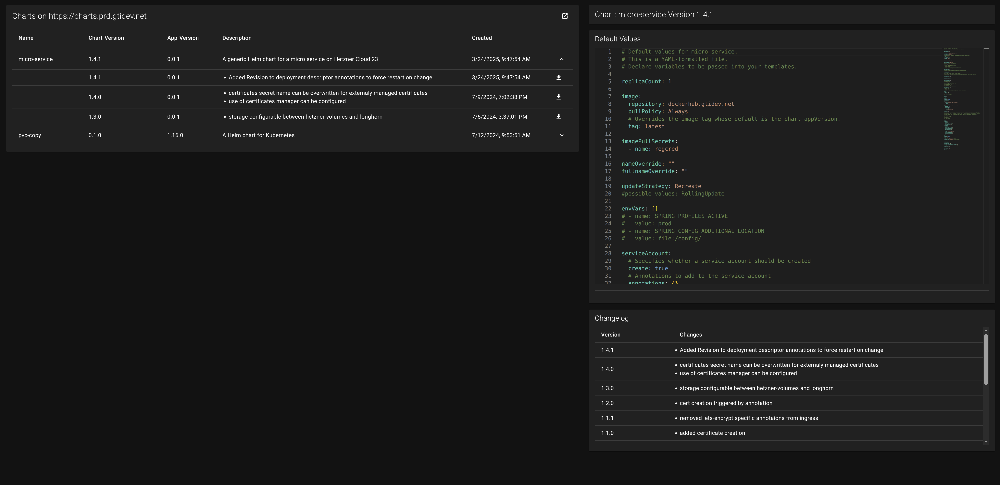

# ChartUI

ChartUI is a very simple UI for [ChartMuseum](https://chartmuseum.com/).

What is can do currently:

* It lists all helmcharts and its versions.
* It shows the default values of the helmchart.
* It shows the helmcharts changelog if provided in the chart archive.

## Build & Install

There is one env-variable that needs to be set when building the node package:

* VITE_CHARTMUSEUM_URL points to the url of your chartmuseum instance.

There is currently no support secured chartmuseum instances.  
